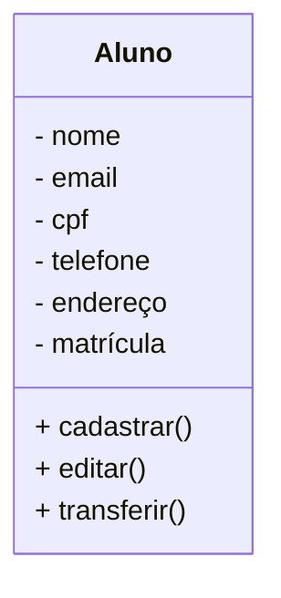

# Projeto Universidade

Modelagem em Orientação à Objetos das Entidades Alunos, Cursos e Turmas.

## Caso de Uso

## Diagrama de Classes

## Dependências
- **VSCode**: IDE (Interface de Desenvolvimento)

- **Mermaid**: Linguagem para confecção de Diagramas em documentos MD (Mark Down)

- **Material Icon Theme**: Tema para colorir as pastas.

- **Git Lens**: Interface gráfica pra o versionamento .git integrada ao VSCode.